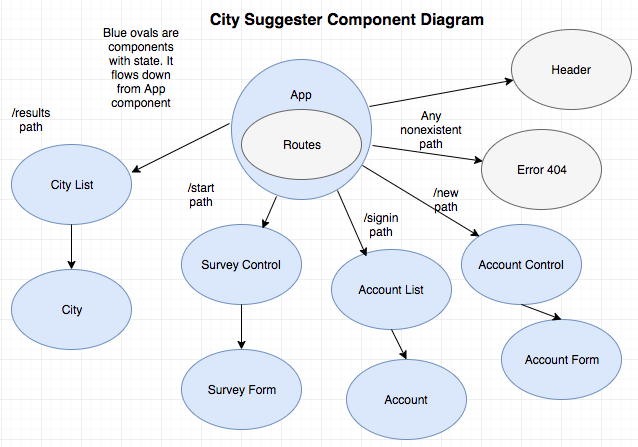

## Project description
#### A web application that recommends cities that a user might want to live in, based on user inputted preferences and city quality of life data. It will utilize a react front-end, with a google firebase database for account and preference management, and api calls to the Teleport API to populate the city quality of life data.

## Name of Student:
#### Alex Noble
## Name of Project:
#### City Suggester (Repo at https://github.com/Anoble25/CitySuggester)

## Project’s Purpose or Goal: (What will it do for users?)
#### It will give city recommendations for a user to visit or move to.

## List the absolute minimum features the project requires to meet this purpose or goal:
#### It will receive input from a user and use the input to make city suggestions.

## What tools, frameworks, libraries, APIs, modules and/or other resources (whatever is specific to your track, and your language) will you use to create this MVP? List them all here. Be specific.

#### React
#### React Native (if time allows)
#### Firebase or MySql database for storing user preferences
#### Teleport for developers api (https://developers.teleport.org/) for city info (cost of living, city happiness, etc)
#### npm (for package/dependency management)

## If you finish developing the minimum viable product (MVP) with time to spare, what will you work on next? Describe these features here: Be specific.
#### A react native version of the website
#### Better site usability
#### Improved visual look

## What additional tools, frameworks, libraries, APIs, or other resources will these additional features require?

#### react native

